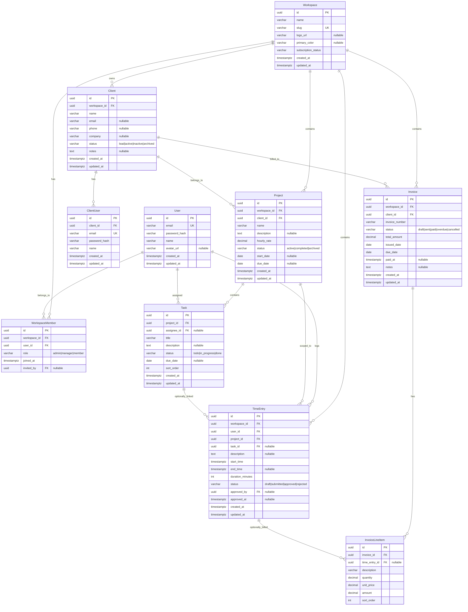

# FlowDesk — Database Design

Covers all MVP entities. Future features (proposals, expenses, payments, file storage) are excluded.

---

## Entity: Workspace

Multi-tenant container. Every piece of data is scoped to a workspace.

| Field | Type | Constraints |
|---|---|---|
| id | UUID | PK, default uuid_generate_v4() |
| name | VARCHAR(255) | NOT NULL |
| slug | VARCHAR(100) | NOT NULL, UNIQUE |
| logo_url | VARCHAR(512) | NULLABLE |
| primary_color | VARCHAR(7) | NULLABLE, hex color (#RRGGBB) |
| subscription_status | VARCHAR(20) | NOT NULL, DEFAULT 'trial', CHECK (IN 'trial','active','cancelled') |
| created_at | TIMESTAMPTZ | NOT NULL, DEFAULT now() |
| updated_at | TIMESTAMPTZ | NOT NULL, DEFAULT now() |

**Relationships** — has many: WorkspaceMember, Client, Project, TimeEntry, Invoice.

---

## Entity: User

Represents any person who logs in — owner, manager, team member. Also used by invited client portal users.

| Field | Type | Constraints |
|---|---|---|
| id | UUID | PK, default uuid_generate_v4() |
| email | VARCHAR(255) | NOT NULL, UNIQUE |
| password_hash | VARCHAR(255) | NOT NULL |
| name | VARCHAR(255) | NOT NULL |
| avatar_url | VARCHAR(512) | NULLABLE |
| created_at | TIMESTAMPTZ | NOT NULL, DEFAULT now() |
| updated_at | TIMESTAMPTZ | NOT NULL, DEFAULT now() |

**Relationships** — has many: WorkspaceMember, TimeEntry, Task (assignee).

---

## Entity: WorkspaceMember

Join table that assigns a user to a workspace with a role.

| Field | Type | Constraints |
|---|---|---|
| id | UUID | PK, default uuid_generate_v4() |
| workspace_id | UUID | NOT NULL, FK → Workspace(id) ON DELETE CASCADE |
| user_id | UUID | NOT NULL, FK → User(id) ON DELETE CASCADE |
| role | VARCHAR(20) | NOT NULL, CHECK (IN 'owner','manager','team_member') |
| joined_at | TIMESTAMPTZ | NOT NULL, DEFAULT now() |
| invited_by | UUID | NULLABLE, FK → User(id) ON DELETE SET NULL |

**Constraints** — UNIQUE(workspace_id, user_id).

**Relationships** — belongs to: Workspace, User.

---

## Entity: Client

CRM record — a company or individual that the workspace does business with.

| Field | Type | Constraints |
|---|---|---|
| id | UUID | PK, default uuid_generate_v4() |
| workspace_id | UUID | NOT NULL, FK → Workspace(id) ON DELETE CASCADE |
| name | VARCHAR(255) | NOT NULL |
| email | VARCHAR(255) | NULLABLE |
| phone | VARCHAR(50) | NULLABLE |
| company | VARCHAR(255) | NULLABLE |
| status | VARCHAR(20) | NOT NULL, DEFAULT 'lead', CHECK (IN 'lead','active','inactive','archived') |
| notes | TEXT | NULLABLE |
| created_at | TIMESTAMPTZ | NOT NULL, DEFAULT now() |
| updated_at | TIMESTAMPTZ | NOT NULL, DEFAULT now() |

**Relationships** — belongs to: Workspace. Has many: Project, Invoice, ClientUser.

---

## Entity: ClientUser

A person from the client side who logs into the client portal.

| Field | Type | Constraints |
|---|---|---|
| id | UUID | PK, default uuid_generate_v4() |
| client_id | UUID | NOT NULL, FK → Client(id) ON DELETE CASCADE |
| email | VARCHAR(255) | NOT NULL, UNIQUE |
| password_hash | VARCHAR(255) | NOT NULL |
| name | VARCHAR(255) | NOT NULL |
| created_at | TIMESTAMPTZ | NOT NULL, DEFAULT now() |
| updated_at | TIMESTAMPTZ | NOT NULL, DEFAULT now() |

**Constraints** — UNIQUE(client_id, email).

**Relationships** — belongs to: Client.

---

## Entity: Project

Work container nested under a client. Holds tasks and time entries.

| Field | Type | Constraints |
|---|---|---|
| id | UUID | PK, default uuid_generate_v4() |
| workspace_id | UUID | NOT NULL, FK → Workspace(id) ON DELETE CASCADE |
| client_id | UUID | NOT NULL, FK → Client(id) ON DELETE RESTRICT |
| name | VARCHAR(255) | NOT NULL |
| description | TEXT | NULLABLE |
| hourly_rate | DECIMAL(10,2) | NOT NULL, DEFAULT 0, CHECK (>= 0) |
| status | VARCHAR(20) | NOT NULL, DEFAULT 'active', CHECK (IN 'active','completed','archived') |
| start_date | DATE | NULLABLE |
| due_date | DATE | NULLABLE |
| created_at | TIMESTAMPTZ | NOT NULL, DEFAULT now() |
| updated_at | TIMESTAMPTZ | NOT NULL, DEFAULT now() |

**Relationships** — belongs to: Workspace, Client. Has many: Task, TimeEntry, Invoice (via line items).

---

## Entity: Task

Individual work item within a project. Assignable to one team member.

| Field | Type | Constraints |
|---|---|---|
| id | UUID | PK, default uuid_generate_v4() |
| project_id | UUID | NOT NULL, FK → Project(id) ON DELETE CASCADE |
| assignee_id | UUID | NULLABLE, FK → User(id) ON DELETE SET NULL |
| title | VARCHAR(255) | NOT NULL |
| description | TEXT | NULLABLE |
| status | VARCHAR(20) | NOT NULL, DEFAULT 'todo', CHECK (IN 'todo','in_progress','done') |
| due_date | DATE | NULLABLE |
| sort_order | INTEGER | NOT NULL, DEFAULT 0 |
| created_at | TIMESTAMPTZ | NOT NULL, DEFAULT now() |
| updated_at | TIMESTAMPTZ | NOT NULL, DEFAULT now() |

**Relationships** — belongs to: Project. Belongs to: User (assignee). Has many: TimeEntry.

---

## Entity: TimeEntry

Logged time against a project, optionally linked to a specific task.

| Field | Type | Constraints |
|---|---|---|
| id | UUID | PK, default uuid_generate_v4() |
| workspace_id | UUID | NOT NULL, FK → Workspace(id) ON DELETE CASCADE |
| user_id | UUID | NOT NULL, FK → User(id) ON DELETE CASCADE |
| project_id | UUID | NOT NULL, FK → Project(id) ON DELETE RESTRICT |
| task_id | UUID | NULLABLE, FK → Task(id) ON DELETE SET NULL |
| description | TEXT | NULLABLE |
| start_time | TIMESTAMPTZ | NOT NULL |
| end_time | TIMESTAMPTZ | NULLABLE |
| duration_minutes | INTEGER | NOT NULL, CHECK (>= 0) |
| status | VARCHAR(20) | NOT NULL, DEFAULT 'draft', CHECK (IN 'draft','submitted','approved','rejected') |
| approved_by | UUID | NULLABLE, FK → User(id) ON DELETE SET NULL |
| approved_at | TIMESTAMPTZ | NULLABLE |
| created_at | TIMESTAMPTZ | NOT NULL, DEFAULT now() |
| updated_at | TIMESTAMPTZ | NOT NULL, DEFAULT now() |

**Constraints** — CHECK (end_time IS NULL OR end_time > start_time).

**Relationships** — belongs to: Workspace, User, Project, Task (optional). Has many: InvoiceLineItem.

---

## Entity: Invoice

Billing document sent to a client. Generated from time entries.

| Field | Type | Constraints |
|---|---|---|
| id | UUID | PK, default uuid_generate_v4() |
| workspace_id | UUID | NOT NULL, FK → Workspace(id) ON DELETE CASCADE |
| client_id | UUID | NOT NULL, FK → Client(id) ON DELETE RESTRICT |
| invoice_number | VARCHAR(50) | NOT NULL |
| status | VARCHAR(20) | NOT NULL, DEFAULT 'draft', CHECK (IN 'draft','sent','paid','overdue','cancelled') |
| total_amount | DECIMAL(12,2) | NOT NULL, DEFAULT 0, CHECK (>= 0) |
| issued_date | DATE | NOT NULL |
| due_date | DATE | NOT NULL, CHECK (due_date >= issued_date) |
| paid_at | TIMESTAMPTZ | NULLABLE |
| notes | TEXT | NULLABLE |
| created_at | TIMESTAMPTZ | NOT NULL, DEFAULT now() |
| updated_at | TIMESTAMPTZ | NOT NULL, DEFAULT now() |

**Constraints** — UNIQUE(workspace_id, invoice_number).

**Relationships** — belongs to: Workspace, Client. Has many: InvoiceLineItem.

---

## Entity: InvoiceLineItem

Individual line on an invoice. May link back to the originating time entry.

| Field | Type | Constraints |
|---|---|---|
| id | UUID | PK, default uuid_generate_v4() |
| invoice_id | UUID | NOT NULL, FK → Invoice(id) ON DELETE CASCADE |
| time_entry_id | UUID | NULLABLE, FK → TimeEntry(id) ON DELETE SET NULL |
| description | VARCHAR(500) | NOT NULL |
| quantity | DECIMAL(10,2) | NOT NULL, DEFAULT 1, CHECK (> 0) |
| unit_price | DECIMAL(10,2) | NOT NULL, CHECK (>= 0) |
| amount | DECIMAL(12,2) | NOT NULL, CHECK (>= 0) |
| sort_order | INTEGER | NOT NULL, DEFAULT 0 |

**Relationships** — belongs to: Invoice. Belongs to: TimeEntry (optional).

---

## Entity Relationship Diagram

---

## Key Constraints Summary

| Constraint | Entity | Detail |
|---|---|---|
| Unique email | User | email is globally unique across all users |
| Unique slug | Workspace | slug identifies the tenant in URLs |
| Unique per-workspace invoice number | Invoice | (workspace_id, invoice_number) unique |
| Unique workspace membership | WorkspaceMember | (workspace_id, user_id) unique |
| Unique client user per client | ClientUser | (client_id, email) unique |
| Valid time range | TimeEntry | end_time must be > start_time when both set |
| Valid date range | Invoice | due_date >= issued_date |
| Non-negative amounts | InvoiceLineItem | quantity > 0, unit_price >= 0, amount >= 0 |
| Cascade deletes | WorkspaceMember, Client, Project, Task, Invoice, InvoiceLineItem | child removed when parent deleted |
| Restrict deletes | Project → TimeEntry, Client → Invoice, Client → Project | prevents orphaned references |
