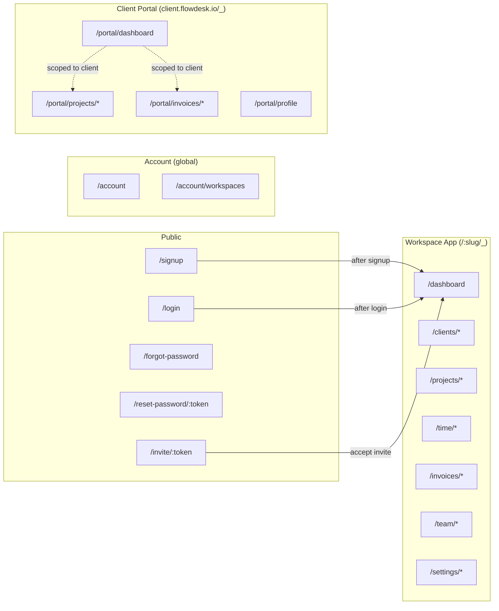

# FlowDesk — Application Routes

All workspace routes are prefixed with the tenant slug. Client portal routes live under a separate subdomain.

URL pattern:
- **App**: `https://app.flowdesk.io/:workspaceSlug/<resource>`
- **Portal**: `https://client.flowdesk.io/<path>`

---

## Auth Routes

Public routes — no authentication required (except logout).

| Route | Method | Purpose |
|---|---|---|
| `/signup` | GET / POST | Create account + workspace. POST creates the workspace and the first OWNER user. |
| `/login` | GET / POST | Authenticate with email/password or Google OAuth redirect. |
| `/forgot-password` | GET / POST | Request password reset email. |
| `/reset-password/:token` | GET / POST | Verify reset token and set new password. |
| `/invite/:token` | GET / POST | Accept workspace invite. POST sets password and creates WorkspaceMember. |
| `/logout` | POST | Destroy session. Redirect to `/login`. |

---

## Dashboard Routes

Authenticated workspace routes. All team roles (OWNER, MANAGER, TEAM_MEMBER) have access.

| Route | Method | Purpose | Access |
|---|---|---|---|
| `/:workspaceSlug/dashboard` | GET | Personal overview — own tasks due soon, own time today, unpaid invoices, recent activity | All team roles |
| `/:workspaceSlug/dashboard/reports` | GET | Workspace-wide metrics — revenue MTD, utilization %, overdue invoices | OWNER, MANAGER |
| `/:workspaceSlug/dashboard/reports/profitability/:projectId` | GET | Profitability drilldown for a single project | OWNER, MANAGER |
| `/:workspaceSlug/dashboard/reports/team-utilization` | GET | Hours logged per team member this period | OWNER, MANAGER |

---

## Client Routes

CRM for managing companies and contacts.

| Route | Method | Purpose | Access |
|---|---|---|---|
| `/:workspaceSlug/clients` | GET | List all clients with status filter and search | OWNER, MANAGER, TEAM_MEMBER (own) |
| `/:workspaceSlug/clients/new` | GET / POST | Create client record | OWNER, MANAGER, TEAM_MEMBER |
| `/:workspaceSlug/clients/:clientId` | GET | Client detail — projects, invoices, contacts | OWNER, MANAGER, TEAM_MEMBER (own) |
| `/:workspaceSlug/clients/:clientId/edit` | GET / PUT | Update client name, status, notes | OWNER, MANAGER, TEAM_MEMBER (own) |
| `/:workspaceSlug/clients/:clientId/archive` | POST | Move client to archived status | OWNER, MANAGER |
| `/:workspaceSlug/clients/:clientId` | DELETE | Permanent delete (only if no active projects/invoices) | OWNER |
| `/:workspaceSlug/clients/:clientId/portal/invite` | POST | Send portal invite email to client contact | OWNER, MANAGER |

---

## Project Routes

Projects are nested under clients. Tasks live inside projects.

| Route | Method | Purpose | Access |
|---|---|---|---|
| `/:workspaceSlug/projects` | GET | List all projects with status filter | OWNER, MANAGER, TEAM_MEMBER (own) |
| `/:workspaceSlug/projects/new` | GET / POST | Create project under a client | OWNER, MANAGER, TEAM_MEMBER |
| `/:workspaceSlug/projects/:projectId` | GET | Project detail — tasks, team, time totals, recent activity | OWNER, MANAGER, TEAM_MEMBER (if assigned/own) |
| `/:workspaceSlug/projects/:projectId/edit` | GET / PUT | Update project name, description, rate, dates | OWNER, MANAGER, TEAM_MEMBER (own) |
| `/:workspaceSlug/projects/:projectId/status` | PUT | Change status (active → completed → archived) | OWNER, MANAGER, TEAM_MEMBER (own) |
| `/:workspaceSlug/projects/:projectId` | DELETE | Delete project and its tasks | OWNER |
| `/:workspaceSlug/projects/:projectId/tasks` | GET | List all tasks for the project | OWNER, MANAGER, TEAM_MEMBER (if assigned/own) |
| `/:workspaceSlug/projects/:projectId/tasks/new` | GET / POST | Create a task | OWNER, MANAGER, TEAM_MEMBER (own projects) |
| `/:workspaceSlug/projects/:projectId/tasks/:taskId` | GET | Task detail | OWNER, MANAGER, TEAM_MEMBER (if assigned) |
| `/:workspaceSlug/projects/:projectId/tasks/:taskId/edit` | GET / PUT | Update task title, status, assignee, due date | OWNER, MANAGER, TEAM_MEMBER (own task) |
| `/:workspaceSlug/projects/:projectId/tasks/:taskId` | DELETE | Remove task | OWNER, MANAGER, TEAM_MEMBER (own) |

---

## Time Tracking Routes

Timer, manual entry, timesheet review, and approval workflow.

| Route | Method | Purpose | Access |
|---|---|---|---|
| `/:workspaceSlug/time` | GET | Time dashboard — running timer, today's entries, weekly summary | All team roles |
| `/:workspaceSlug/time/entries` | GET | Paginated list of all time entries with date/project/user filters | OWNER, MANAGER (all), TEAM_MEMBER (own) |
| `/:workspaceSlug/time/entries/new` | GET / POST | Manually log a time entry | All team roles |
| `/:workspaceSlug/time/timer/start` | POST | Start timer for a project/task | All team roles |
| `/:workspaceSlug/time/timer/stop` | POST | Stop running timer, finalize entry | All team roles |
| `/:workspaceSlug/time/entries/:entryId/edit` | GET / PUT | Edit draft entry (description, duration) | All team roles (own), OWNER (any) |
| `/:workspaceSlug/time/entries/:entryId` | DELETE | Delete draft entry | All team roles (own), OWNER (any) |
| `/:workspaceSlug/time/entries/:entryId/submit` | POST | Submit entry for approval | All team roles |
| `/:workspaceSlug/time/approvals` | GET | Pending timesheets queue — entries awaiting approval | OWNER, MANAGER |
| `/:workspaceSlug/time/approvals/:entryId/approve` | POST | Approve a submitted entry | OWNER, MANAGER |
| `/:workspaceSlug/time/approvals/:entryId/reject` | POST | Reject a submitted entry with reason | OWNER, MANAGER |

---

## Invoice Routes

Generate, send, and track invoices.

| Route | Method | Purpose | Access |
|---|---|---|---|
| `/:workspaceSlug/invoices` | GET | List all invoices with status filter | OWNER, MANAGER, TEAM_MEMBER (own) |
| `/:workspaceSlug/invoices/new` | GET / POST | Create invoice — select client, pull in unbilled time entries | OWNER |
| `/:workspaceSlug/invoices/:invoiceId` | GET | Invoice detail — line items, totals, status history | OWNER (all), MANAGER (all), TEAM_MEMBER (own), CLIENT (portal) |
| `/:workspaceSlug/invoices/:invoiceId/edit` | GET / PUT | Update draft invoice line items | OWNER |
| `/:workspaceSlug/invoices/:invoiceId/send` | POST | Mark as sent, notify client via email | OWNER |
| `/:workspaceSlug/invoices/:invoiceId/pay` | POST | Record payment — mark as paid with date | OWNER |
| `/:workspaceSlug/invoices/:invoiceId/void` | POST | Void/cancel invoice | OWNER |
| `/:workspaceSlug/invoices/:invoiceId` | DELETE | Delete draft invoice only | OWNER |
| `/:workspaceSlug/invoices/:invoiceId/pdf` | GET | Download invoice as PDF | OWNER, MANAGER |

---

## Team Routes

Workspace member management — invite, list, change roles, remove.

| Route | Method | Purpose | Access |
|---|---|---|---|
| `/:workspaceSlug/team` | GET | List all workspace members with roles | OWNER, MANAGER |
| `/:workspaceSlug/team/invite` | GET / POST | Send invite email to new member | OWNER |
| `/:workspaceSlug/team/:memberId/role` | PUT | Change member role (member ↔ manager) | OWNER |
| `/:workspaceSlug/team/:memberId` | DELETE | Remove member from workspace | OWNER |
| `/:workspaceSlug/team/transfer-ownership` | POST | Transfer workspace ownership to another member | OWNER |

---

## Settings Routes

Workspace configuration and account management.

| Route | Method | Purpose | Access |
|---|---|---|---|
| `/:workspaceSlug/settings` | GET | Settings overview / landing | OWNER, MANAGER |
| `/:workspaceSlug/settings/general` | GET / PUT | Workspace name, timezone, date format | OWNER |
| `/:workspaceSlug/settings/branding` | GET / PUT | Logo, primary color, favicon | OWNER |
| `/:workspaceSlug/settings/billing` | GET / PUT | Subscription plan, payment method, invoice history | OWNER |
| `/:workspaceSlug/settings/team` | GET | Team overview (redirect to /team) | OWNER, MANAGER |
| `/account` | GET / PUT | Personal profile — name, email, avatar, password | All authenticated users |
| `/account/workspaces` | GET | Switch between workspaces the user belongs to | All authenticated users |

---

## Client Portal Routes

Separate subdomain (`client.flowdesk.io`). Only CLIENT role users can access. These routes are scoped to the client's own data only — no workspace slug is needed because the ClientUser record is linked to a single Client.

| Route | Method | Purpose | Access |
|---|---|---|---|
| `/portal/login` | GET / POST | Client portal login | Unauthenticated |
| `/portal/dashboard` | GET | Overview — active projects, unpaid invoices, recent messages | CLIENT |
| `/portal/projects` | GET | List of own projects | CLIENT |
| `/portal/projects/:projectId` | GET | Project detail — tasks, progress, completion status | CLIENT |
| `/portal/projects/:projectId/tasks` | GET | View task list with statuses | CLIENT |
| `/portal/invoices` | GET | List of invoices (paid / unpaid) | CLIENT |
| `/portal/invoices/:invoiceId` | GET | Invoice breakdown — line items, totals, due date | CLIENT |
| `/portal/profile` | GET / PUT | Update own name, email, password | CLIENT |

---

## Route Architecture Diagram



---

## Route Guard Summary

All non-public routes require authentication and multi-tenant authorization.

```
Request → Authenticate (session/token) → Identify workspace from slug
  → Resolve user's role in workspace → Check permission matrix
  → Scope query to workspace_id → Return response

Client portal requests → Authenticate as ClientUser
  → Scope query to linked client_id → Return response
```
