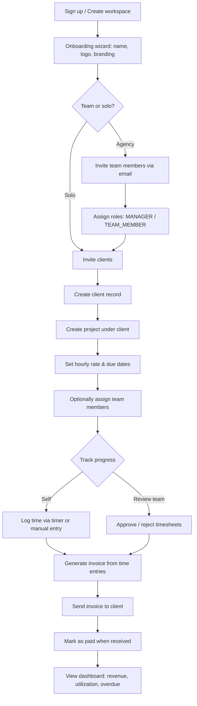
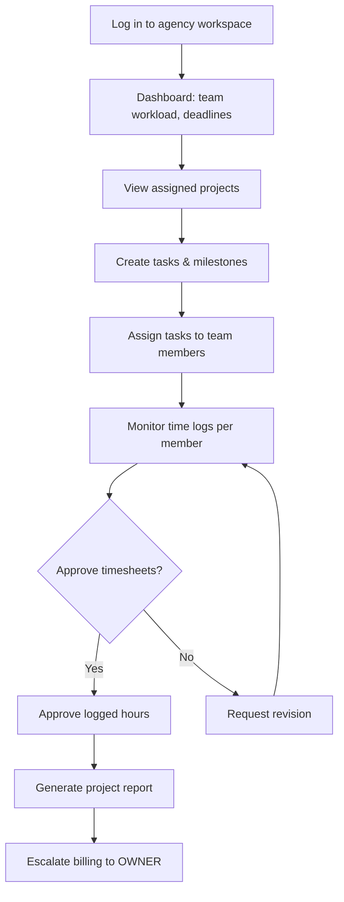
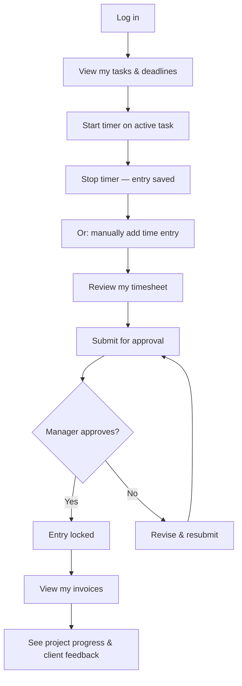
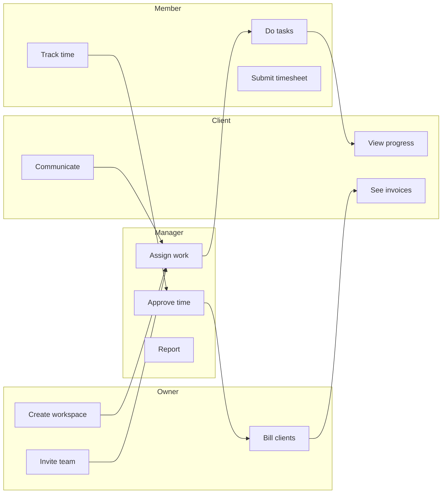

# FlowDesk — User Flows

---

## Owner Journey

OWNER — agency owner or solo freelancer who owns the workspace.



---

## Manager Journey

Agency team member with elevated permissions — oversees projects and people but does not own billing/workspace settings.



---

## Team Member Journey

Individual contributor — sees only their own work, clients, and time.



---

## Client Journey

External user — limited, read-only portal.

```mermaid
flowchart TD
    A[Receive invite email from workspace] --> B[Set password / accept invite]
    B --> C[Log in to client portal]
    C --> D[Dashboard: active projects & unpaid invoices]
    D --> E[View project details & task progress]
    E --> F[View invoice breakdown]
    F --> G{Payment handling}
    G -->|MVP| H[Invoice shows "paid" / "unpaid" — no online payment]
    G -->|Future| I[Pay invoice via Stripe / PayPal]
    H --> J[Send message / request change]
    I --> J
    J --> K[Project completes → archive]
```

---

## Cross-Journey Summary


